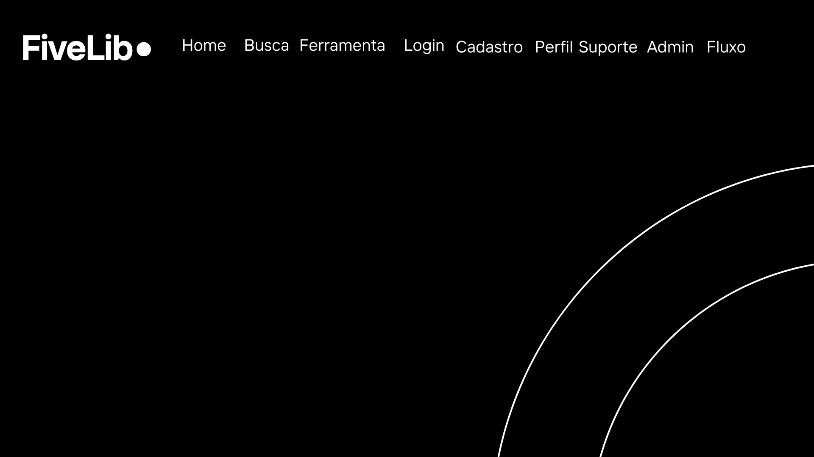
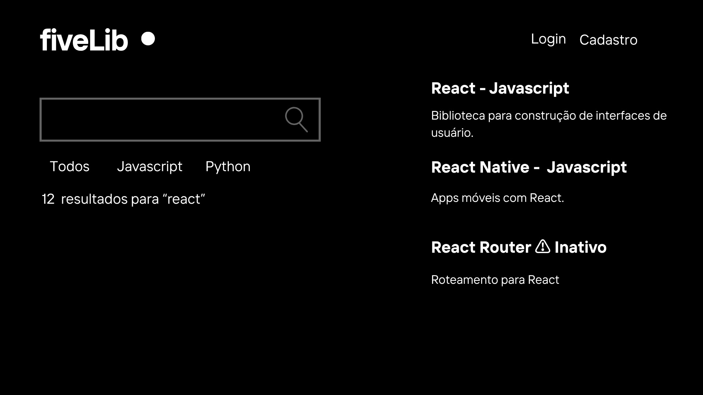
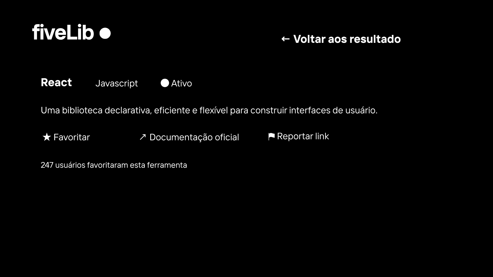
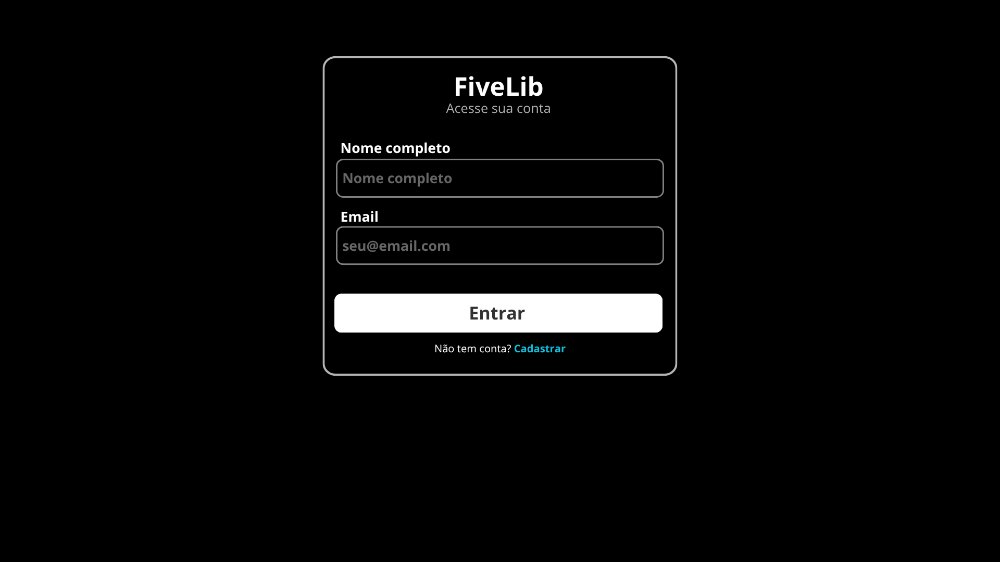
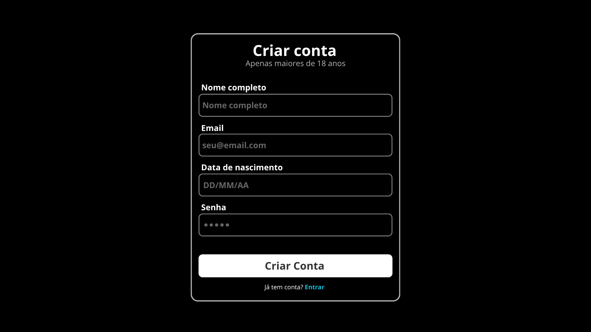
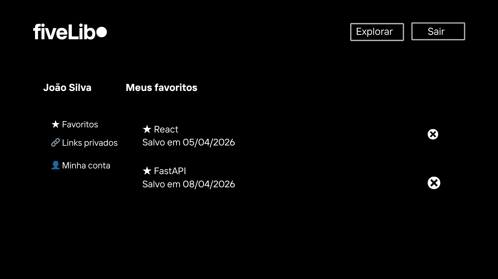
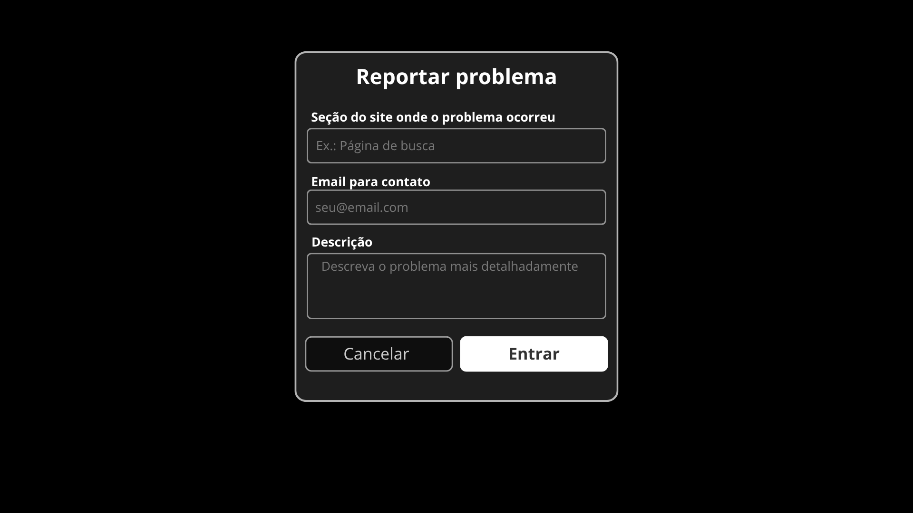
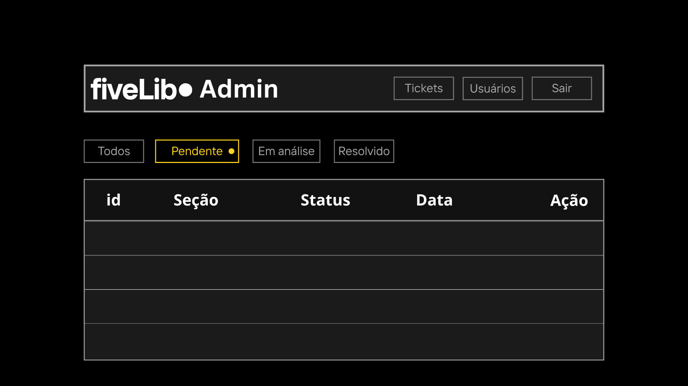

# 🎨 Guia de Identidade Visual e Prototipação - FiveLib

Este documento define o esqueleto visual, a tipografia, as cores e os componentes principais da plataforma FiveLib. Ele serve como base para a implementação do Frontend, respeitando os requisitos definidos no PRD e no Dicionário de Dados.

## 1. Mapeamento e Fluxo

O mapeamento completo das interfaces e a lógica de interação foram estruturados para garantir uma experiência de usuário fluida, conforme detalhado no arquivo `fivelib_screens_map.html`.

* **Mapeamento de Interfaces:** O sistema é composto por 8 telas principais, identificadas de **T1 (Home)** a  **T8 (Admin)** . Essa estrutura abrange todo o escopo do projeto, incluindo os mecanismos de busca, o gerenciamento de bibliotecas personalizadas e os canais de suporte técnico.
* **Dinâmica de Navegação:** O fluxo foi projetado para guiar o usuário de maneira intuitiva. O percurso inicia-se na **Home** para visualização geral, avança para a **Busca** refinada e, mediante autenticação no  **Login/Cadastro** , permite a persistência de dados e gestão de favoritos dentro do **Perfil** do usuário.

## 2. Identidade Visual (Design Tokens)

### 2.1 Paleta de Cores

Definição das cores principais da aplicação (valores Hexadecimais):

* **Primary (Marca):** `#ffffff`
* **Background (Fundo):** `#000000`
* **Text Primary (Texto Principal):** `#000000`
* **Text Secondary (Texto Secundário):** `#0cc0df`
* **Success / Info / Warning / Danger:**
  * **Accent (Cor do link)**: #0cc0df
  * **Stroke (Cor da borda)**: #b4b4b4
  * **Activate (Item selecionado):** #ffd21d

### 2.2 Tipografia

* **Fonte Principal (Sans-serif):** `Inter`, `Roboto`, ou `System UI`. (Usada em títulos e leitura).

## 3. Wireframes e Telas Principais (Mockups)

Os wireframes abaixo foram desenhados manualmente (Passo 3 da atividade) com base nos atributos do DER e casos de uso.

### Tela: T1 — Landing Page / Home

* **Objetivo:** Apresentar o sistema e listar ferramentas em destaque.
* **Campos do DER:** Nome da ferramenta (`tool.nome`), descrição (`tool.descricao`) e linguagem (`tool.linguagem`).
* **Imagem:** [/assets/mockup/1-home.png](/assets/mockup/1-home.png)

### Tela: T2 — Busca

* **Objetivo:** Localizar bibliotecas específicas através de filtros e termos de pesquisa.
* **Campos do DER:** `tool.nome`, `tool.linguagem` e `tool.descricao`.
* **Imagem:** [/assets/mockup/1-busca.png](/assets/mockup/2-busca.png)

### Tela: T3 — Detalhe da Ferramenta

* **Objetivo:** Exibir informações completas de uma ferramenta e permitir a ação de favoritar.
* **Campos do DER:** `tool.nome`, `tool.descricao`, `tool.url_oficial`, `tool.linguagem` e `favorite.usuario_id`.
* **Imagem:** [/assets/mockup/3-ferramenta.png](/assets/mockup/3-ferramenta.png)

### Tela: T4 — Login

* **Objetivo:** Autenticar o usuário.
* **Campos do DER:** E-mail (`user.email`) e senha (`user.senha`).
* **Imagem:** [/assets/mockup/4-login.png](/assets/mockup/4-login.png)

### Tela: T5 — Cadastro

* **Objetivo:** Permitir que novos utilizadores criem uma conta na plataforma para acederem a funcionalidades personalizadas (favoritos e links privados).
* **Campos do DER:** `user.nome`, `user.email`, `user.senha` e `user.data_nascimento` (essencial para a regra de negócio de maioridade).
* **Imagem:** [/assets/mockup/5-cadastro.png](/assets/mockup/5-cadastro.png)

### Tela: T6 — Perfil (Biblioteca Pessoal)

* **Objetivo:** Gerenciar favoritos (RN03).
* **Campos do DER:** Lista de ferramentas relacionadas via tabela **Favorite** e links privados da tabela  **PrivateLink** .
* **Imagem:** [/assets/mockup/6-perfil.png](/assets/mockup/6-perfil.png)

### Tela: T7 — Suporte

* **Objetivo:** Canal de comunicação para o usuário enviar dúvidas ou reportar erros.
* **Campos do DER:** `support_ticket.email_contato`, `support_ticket.mensagem` e `support_ticket.secao_site`.
* **Imagem:** [/assets/mockup/7-suporte.png](/assets/mockup/7-suporte.png)

### Tela: T8 — Admin (Dashboard)

* **Objetivo:** Gestão administrativa de usuários, ferramentas e tickets de suporte.
* **Campos do DER:** `support_ticket.status`, `user.perfil` e `tool.status_ativo`.
* **Imagem:** [/assets/mockup/8-admin.png](/assets/mockup/8-admin.png)

---

## 4. Relação DER x Interface

Abaixo, explicamos como a modelagem de dados foi transposta para elementos visuais:

1. **Entidade `Tool` → Cards de Interface:** Cada registro na tabela **Tool** gera um card visual na Home. O campo `url_oficial` foi transformado em um botão de ação "Acessar Site".
2. **Entidade `Favorite` → Lista de Desejos:** A relação N:N entre usuários e ferramentas permitiu a criação da tela de Perfil. O campo `adicionado_at` é exibido como um rótulo "Favoritado em: [Data]".
3. **Entidade `SupportTicket` → Central de Ajuda:** Os atributos `mensagem` e `secao_site` tornaram-se campos de um formulário de contato, enquanto o `status` (Pendente/Resolvido) aparece como uma etiqueta visual para o usuário acompanhar sua solicitação.
4. **Entidade `PrivateLink` → Links Customizados:** O relacionamento 1:N com o **User** possibilitou uma seção exclusiva no Perfil onde o usuário gerencia seus próprios links de estudo (`titulo` e `url`).

## 5. Anexos Técnicos e Referências

A tabela abaixo centraliza os artefatos de suporte utilizados para a construção da interface e validação dos fluxos.

| Localização do Arquivo            | Tipo de Recurso               | Descrição Sucinta                                                                                                        |
| ----------------------------------- | ----------------------------- | -------------------------------------------------------------------------------------------------------------------------- |
| `assets/fivelib_screens_map.html` | **Mapa Interativo**     | Protótipo funcional que detalha a lista de telas, fluxos de navegação e a correlação entre Casos de Uso e requisitos. |
| `assets/mockup/`                  | **Repositório Visual** | Pasta contendo os wireframes digitais e fotos dos protótipos em papel, servindo como guia de layout para o frontend.      |
